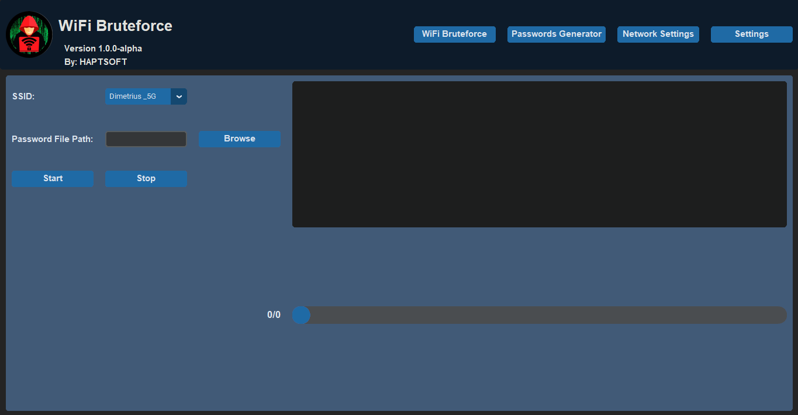
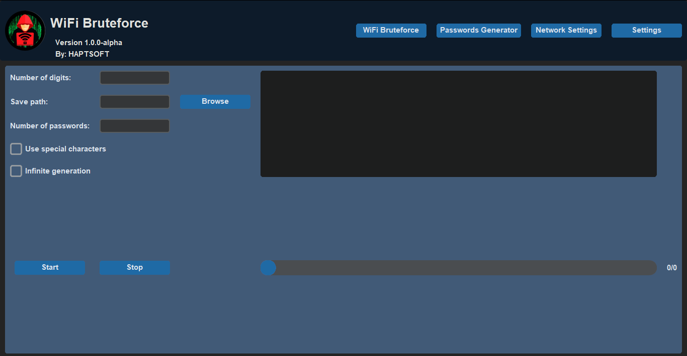
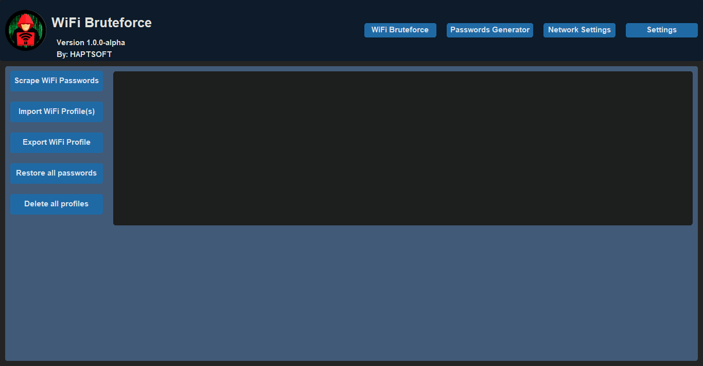
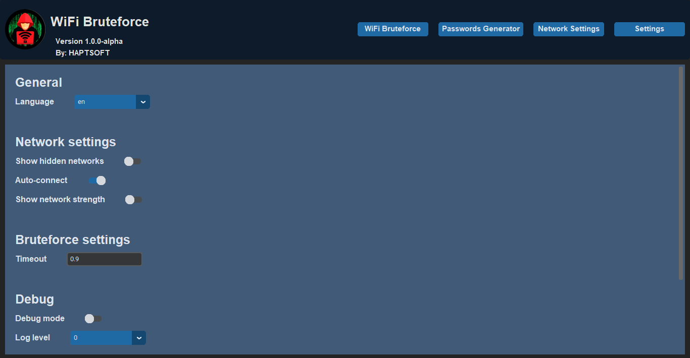

# **Wi-Fi Bruteforce**

  <picture>
    <source media="(prefers-color-scheme: dark)" srcset="media/wifi-bruteforce-logo.png">
    
  </picture>

# Installation

### Download the wifi-bruteforce.zip from releases and unpack it

> ### Note: you need to disable antivirus before downloading except program can't work (Windows Defender considers the program malicious due to the lack of a certificate and manipulatung the network)

### After unpacking launch the main.exe file, if a window appears about opening a file, ignore it and click anywhere where it is not there.
### The menu that you would to see:

  <picture>
    <source media="(prefers-color-scheme: dark)" srcset="media/main-menu-1.png">
    
  </picture>

# How to use

### In the SSID field select the network that you want to hack
### After that, select the file with passwords
> ### Attention! Program deleting all Wi-Fi profiles, if you want to save it first [read this](#networks-settings) or remember the password if you know it
### After selecting, press the start button and wait for end of hacking, at the text-field you can see the process of hacking

# Passwords generator

  <picture>
    <source media="(prefers-color-scheme: dark)" srcset="media/passwords-generator.png">
    
  </picture>

### In the first field input how many characters will be in the password
### In the second field choose the directory where to save passwords
### And at last, input how much passwords generate to (ignoring this value if infinite generation option is choosed)
### Click the start button to start generate passwords

## Other options

### Use special characters - use other characters as % @ = and other
### Infinite generation - generating passwords endlessly

# Networks Settings

  <picture>
    <source media="(prefers-color-scheme: dark)" srcset="media/network-settings.png">
    
  </picture>

### To update the networks saved on your PC click on "Scrape WiFi Passwords"
### To save the network in file click Export WiFi profile and input the SSID of the network you want to save
> ### The all saved networks are storing in 'directory with program'/files/wifi-profiles/
### To import the network click Import WiFi profiles and choose the .xml file of network that you choosing
> ### You also can export the .xml network file and send it to your friend and he can import it using this program

# Settings

  <picture>
    <source media="(prefers-color-scheme: dark)" srcset="media/settings.png">
    
  </picture>

### There is the list with settings of the program

|Setting|Function|
|---------|----------------------------------------------------------------------------------|
|Language|Using language that selected|
|Show hidden networks|Showing hidden networks as 'HNET1' 'HNET2' etc.|
|Auto-connect|Auto connecting to the network after successfully hack|
|Show network strenght|After choosing the network, showing it strength|
|Timeout|Setting the timeout between connect with password|
|Debug mode|Opening the new console with all logs (auto choosing log level 2)|
|Log level|Setting the detail level of logs (choosing the 'Debug mode' auto set to level 2)|

## Have issues? Watch the video tutorial how to use program [click there](https://www.youtube.com/watch?v=270AQHkKvek)

